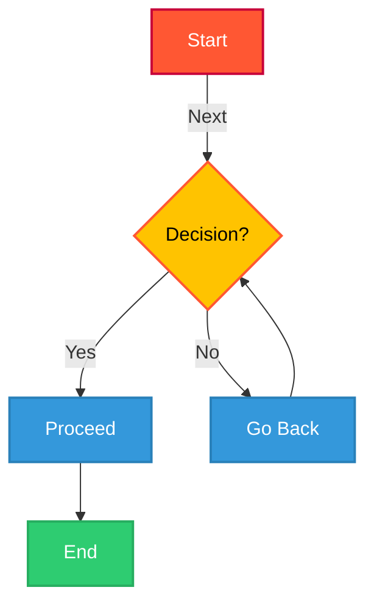

# 📖 How to Write a Markdown File

## 📌 Table of Contents
- [Introduction](#introduction)
- [Headers](#headers)
- [Blockquotes](#blockquotes)
- [Code Blocks and Inline Code](#code-blocks-and-inline-code)
- [Links and Hyperlinks](#links-and-hyperlinks)
- [Link with Tooltip](#link-with-tooltip)
- [Adding Images](#adding-images)
- [Images with Link](#images-with-link)
- [Lists](#lists)
- [Checklists (Clickable To-Do Lists)](#checklists-clickable-to-do-lists)
- [Checklist using HTML](#checklist-using-html)
- [Footnotes](#footnotes)
- [Escaping Characters](#escaping-characters)
- [Mathematical Symbols](#mathematical-symbols)
- [Mermaid Diagrams](#mermaid-diagrams)
- [Indentation](#indentation-adding-spaces-to-text))
- [Keyboard Shortcuts Formatting](#keyboard-shortcuts-formatting)
- [Superscript and Subscript](#superscript-and-subscript)
- [Text Highlighting and Colors](#text-highlighting-and-colors)
- [Text Alignment](#text-alignment)
- [Multi-Column Layout](#multi-column-layout)
- [Spoilers](#spoilers)
- [Progress Bar](#progress-bar)
- [Interactive Buttons](#interactive-buttons)
- [Adding Collapsible Sections](#adding-collapsible-sections)
- [Tables](#tables)
- [Limitations of Markdown Features](#limitations-of-markdown-features)
- [Conclusion](#conclusion)

---

## 📝 Introduction
Markdown is a lightweight markup language that makes it easy to format text using simple syntax. It is widely used for writing documentation, README files, and blog posts.

---

## 🔠 Headers
```md
# H1 Header
## H2 Header
### H3 Header
#### H4 Header
##### H5 Header
###### H6 Header
```
📌 **Output:**
# H1 Header
## H2 Header
### H3 Header
#### H4 Header
##### H5 Header
###### H6 Header

---

## 💬 Blockquotes
```md
> This is a blockquote.
> - It can be used for highlighting notes.
```
📌 **Output:**
> This is a blockquote.
> - It can be used for highlighting notes.

---

## 🔲 Code Blocks and Inline Code
### 🔹 Inline Code
```md
`Inline code example`
```
📌 **Output:** `Inline code example`

### 🔹 Code Block
```md
``` cpp
    #include<bits/stdc++.h>
    using namespace std;

    int main() {

    }
    ```
```
📌 **Output:**
``` cpp
    #include<bits/stdc++.h>
    using namespace std;

    int main() {

    }
```

---

## 🔗 Links and Hyperlinks
```md
[Visit Google](https://www.google.com)
```
📌 **Output:** [Visit Google](https://www.google.com)

---

## 📝 Link with Tooltip
```md
[Hover over me](https://example.com "This is a tooltip")
```
📌 **Output:** [Hover over me](https://example.com "This is a tooltip")

---

## 🖼️ Adding Images
```md

```

## 🔗 Images with Link
```md
[](https://example.com)
```

---

## 📃 Lists
> ### Unordered Lists (Bullets)
```md
    - Item 1
    - Item 2
      - Sub-item 1
      - Sub-item 2
```
📌 **Output:**
- Item 1
- Item 2
  - Sub-item 1
  - Sub-item 2

> ### Remove Bullet Points (Without List Style)
```md
    <ul style="list-style-type: none;">
      <li>Item 1</li>
      <li>Item 2</li>
    </ul>
```
📌 **Output:**
<ul style="list-style-type: none;">
  <li>Item 1</li>
  <li>Item 2</li>
</ul>

---

## ✅ Checklists-clickable-to-do-lists
```md
    - [x] Task 1 (Completed)
    - [ ] Task 2 (Pending)
    - [ ] Task 3 (Pending)
```
📌 **Output:**
- [x] Task 1 (Completed)
- [ ] Task 2 (Pending)
- [ ] Task 3 (Pending)


---
## ✅ Checklist using HTML
```html
<input type="checkbox"> Task 1 <br>
<input type="checkbox" checked> Task 2
```
📌 **Output:**
<input type="checkbox"> Task 1 <br>
<input type="checkbox" checked> Task 2

---

## 🔢 Footnotes
```md
Here is a sentence with a footnote.[^1]

[^1]: This is the footnote text.
```

---

## 🎭 Escaping Characters
Use a backslash `\` before special characters:
```md
\*Not bold\*
```
📌 **Output:** \*Not bold\*

---

## 📐 Mathematical Symbols
```md
$\sum_{i=1}^{n} i^2$
```
📌 **Output:**  
$\sum_{i=1}^{n} i^2$

### Additional Math:
- Greek Letters: \( \alpha, \beta, \gamma, \delta \)
- Fractions: \( \frac{a}{b} \)
- Summation: \( \sum_{i=1}^{n} i^2 \)
- Integral: \( \int_0^1 x^2 \,dx \)
- Matrix:
  \[
  \begin{bmatrix}
  a & b \\
  c & d
  \end{bmatrix}
  \]

  latex not supported everywhere or mathJax

📌 **Output:**  
- α, β, γ, δ
- a/b
- ∑(i=1 to n) i²
- ∫₀¹ x² dx
- [ a  b ]
  [ c  d ]


---

## 📊 Mermaid Diagrams
```md
  ```mermaid
    graph TD;
      A[Start] -->|Next| B{Decision?};

      %% Decision branches
      B -- Yes --> C[Proceed];
      B -- No --> D[Go Back];
      C --> F[End];
      D --> B;

      %% Styling for nodes
      classDef start fill:#FF5733,stroke:#C70039,stroke-width:2px,color:white;
      classDef decision fill:#FFC300,stroke:#FF5733,stroke-width:2px,color:black;
      classDef process fill:#3498db,stroke:#2980b9,stroke-width:2px,color:white;
      classDef finalNode fill:#2ecc71,stroke:#27ae60,stroke-width:2px,color:white;

      %% Assign classes to nodes
      class A start;
      class B decision;
      class C process;
      class D process;
      class F finalNode;
    ```
``` 

📌 **Output:**  


---

## 👉 Indentation (Adding Spaces to Text)
Markdown ignores multiple spaces. To force indentation, use non-breaking spaces (&nbsp; in HTML):
``` md
  &nbsp;&nbsp;&nbsp;&nbsp;This is an indented line.

```

📌 **Output:**  
  &nbsp;&nbsp;&nbsp;&nbsp;This is an indented line.

---
## ⌨️ Keyboard Shortcuts Formatting
You can display keyboard shortcuts using HTML <kbd>.
``` md
  Press <kbd>Ctrl</kbd> + <kbd>C</kbd> to copy.

```

📌 **Output:**  
  Press <kbd>Ctrl</kbd> + <kbd>C</kbd> to copy.


---
## 🔢 Superscript & Subscript
> ### A. Superscript (Exponent)
``` md
  X^2^ + Y^2^ = Z^2

```

📌 **Output:**  
  X^2^ + Y^2^ = Z^2


> ### B. Subscript (Lowered Text)
``` md
  H~2~O is water.
```
📌 **Output:**  
  H~2~O is water.

---

## 🔴 Text Highlighting and Colors
> ### Highlighting Text
Some Markdown processors support highlighting using HTML:
``` md
  This is <mark>highlighted text</mark>.

```

📌 **Output:**  
  This is <mark>highlighted text</mark>.

> ### Text Coloring (Using HTML)
Markdown does not support colored text by default, but you can use inline HTML:
``` md
  <span style="color: red;">This text is red</span>
  **<div style="color: red;">This text is red with bold</div>**/

```

📌 **Output:**  
  <span style="color: red;">This text is red</span>
  **<div style="color: red;">This text is red with bold</div>**

---

## 📄 Text Alignment
> ### Centering Text
Markdown does not support text alignment by default, but you can use HTML.
``` md
  <p align="center">This text is centered.</p>


```

📌 **Output:**  
  <p align="center">This text is centered.</p>

---

## 📰 Multi-column Layout
If you want columns (side-by-side content), use HTML tables:
``` md
<table>
  <tr>
    <td>Column 1</td>
    <td>Column 2</td>
  </tr>
  <tr>
    <td>Content 1</td>
    <td>Content 2</td>
  </tr>
</table>

```

📌 **Output:**  
<table>
  <tr>
    <td>Column 1</td>
    <td>Column 2</td>
  </tr>
  <tr>
    <td>Content 1</td>
    <td>Content 2</td>
  </tr>
</table>


---
## ☁️ Spoilers
``` md
<details>
  <summary>Click for Spoiler</summary>
  Darth Vader is Luke's father.
</details>
```

📌 **Output:**  
<details>
  <summary>Click for Spoiler</summary>
  Darth Vader is Luke's father.
</details>

---

## 📈 Progress Bar
Markdown doesn’t support progress bars natively, but you can fake one using Unicode characters or HTML:

> ### Fake
``` md
🔵🔵🔵⚪⚪ 60% Complete

```

📌 **Output:**  
🔵🔵🔵⚪⚪ 60% Complete

> ### Using HTML
``` md
<progress value="60" max="100"></progress>
```

📌 **Output:**  
<progress value="60" max="100"></progress>
---
## 🔘 Interactive Buttons
GitHub does not support clickable buttons, but you can use HTML:
``` md
<a href="https://github.com" style="padding:10px 20px; margin:100px; background:#007bff; color:white; text-decoration:none; border-radius:5px;">Click Me</a>

```

📌 **Output:**  
<a href="https://github.com" style="padding:10px 20px; margin:100px; background:#007bff; color:white; text-decoration:none; border-radius:5px;">Click Me</a>

---
## 🗞️ Collapsible Content
``` md
<details>
  <summary>Click to expand</summary>
  This is hidden content that will appear when clicked.
</details>
```

📌 **Output:**  
<details>
  <summary>Click to expand</summary>
  This is hidden content that will appear when clicked.
</details>

---
## 📅 Tables
``` md
| Name  | Age | Country  |
|-------|-----|---------|
| John  | 25  | USA     |
| Alice | 30  | Canada  |
| Bob   | 27  | UK      |
```

📌 **Output:**  
| Name  | Age | Country  |
|-------|-----|---------|
| John  | 25  | USA     |
| Alice | 30  | Canada  |
| Bob   | 27  | UK      |

---


## 🔽 Limitations of Markdown Features
While Markdown is powerful, some features may not work in all platforms:
- HTML-based features (like colors, buttons, checklists) **may not work in plain `.md` files**.
- LaTeX Math support varies between platforms.
- Mermaid Diagrams require **special rendering support**.

---

## 🎯 Conclusion
Markdown is a powerful yet simple way to write formatted text. With features like checklists, collapsible sections, and tables, you can make your documents interactive and visually appealing!