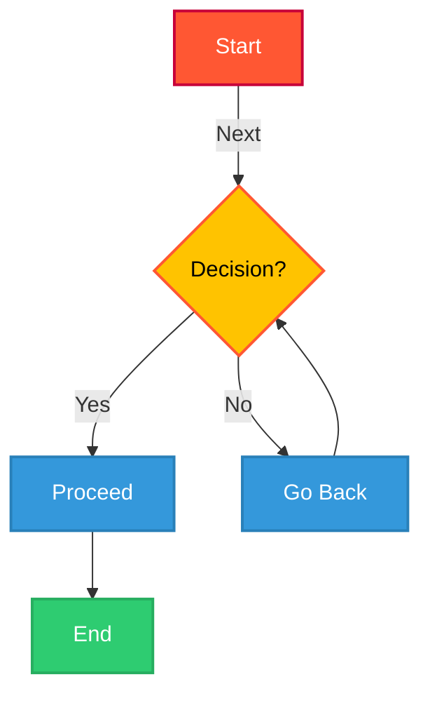

# 📖 How to Write a Markdown File

## 📌 Table of Contents
- [Introduction](#introduction)
- [Headers](#headers)
- [Blockquotes](#blockquotes)
- [Code Blocks and Inline Code](#code-blocks-and-inline-code)
- [Links and Hyperlinks](#links-and-hyperlinks)
- [Link with Tooltip](#link-with-tooltip)
- [Adding Images](#adding-images)
- [Images with Link](#images-with-link)
- [Lists](#lists)
- [Checklists (Clickable To-Do Lists)](#checklists-clickable-to-do-lists)
- [Checklist using HTML](#checklist-using-html)
- [Footnotes](#footnotes)
- [Escaping Characters](#escaping-characters)
- [Mathematical Symbols](#mathematical-symbols)
- [Mermaid Diagrams](#mermaid-diagrams)
- [Keyboard Shortcuts Formatting](#keyboard-shortcuts-formatting)
- [Superscript and Subscript](#superscript-and-subscript)
- [Text Highlighting and Colors](#text-highlighting-and-colors)
- [Text Alignment](#text-alignment)
- [Multi-Column Layout](#multi-column-layout)
- [Spoilers](#spoilers)
- [Progress Bar](#progress-bar)
- [Interactive Buttons](#interactive-buttons)
- [Custom Fonts](#custom-fonts)
- [Adding Collapsible Sections](#adding-collapsible-sections)
- [Tables](#tables)
- [Emojis in Markdown](#emojis-in-markdown)
- [Collapsible Headings](#collapsible-headings)
- [Limitations of Markdown Features](#limitations-of-markdown-features)
- [Conclusion](#conclusion)

---

## 📝 Introduction
Markdown is a lightweight markup language that makes it easy to format text using simple syntax. It is widely used for writing documentation, README files, and blog posts.

---

## 🔠 Headers
```md
# H1 Header
## H2 Header
### H3 Header
#### H4 Header
##### H5 Header
###### H6 Header
```
📌 **Output:**
# H1 Header
## H2 Header
### H3 Header
#### H4 Header
##### H5 Header
###### H6 Header

---

## 💬 Blockquotes
```md
> This is a blockquote.
> - It can be used for highlighting notes.
```
📌 **Output:**
> This is a blockquote.
> - It can be used for highlighting notes.

---

## 🔲 Code Blocks and Inline Code
### 🔹 Inline Code
```md
`Inline code example`
```
📌 **Output:** `Inline code example`

### 🔹 Code Block
```md
``` cpp
    #include<bits/stdc++.h>
    using namespace std;

    int main() {

    }
    ```
```
📌 **Output:**
``` cpp
    #include<bits/stdc++.h>
    using namespace std;

    int main() {

    }
```

---

## 🔗 Links and Hyperlinks
```md
[Visit Google](https://www.google.com)
```
📌 **Output:** [Visit Google](https://www.google.com)

---

## 📝 Link with Tooltip
```md
[Hover over me](https://example.com "This is a tooltip")
```
📌 **Output:** [Hover over me](https://example.com "This is a tooltip")

---

## 🖼️ Adding Images
```md

```

## 🔗 Images with Link
```md
[](https://example.com)
```

---

## ✅ Checklists-clickable-to-do-lists
```md
    - [x] Task 1 (Completed)
    - [ ] Task 2 (Pending)
    - [ ] Task 3 (Pending)
```
📌 **Output:**
- [x] Task 1 (Completed)
- [ ] Task 2 (Pending)
- [ ] Task 3 (Pending)


---
## ✅ Checklist using HTML
```html
<input type="checkbox"> Task 1 <br>
<input type="checkbox" checked> Task 2
```
📌 **Output:**
<input type="checkbox"> Task 1 <br>
<input type="checkbox" checked> Task 2

---

## 🔢 Footnotes
```md
Here is a sentence with a footnote.[^1]

[^1]: This is the footnote text.
```

---

## 🎭 Escaping Characters
Use a backslash `\` before special characters:
```md
\*Not bold\*
```
📌 **Output:** \*Not bold\*

---

## 📐 Mathematical Symbols
```md
$\sum_{i=1}^{n} i^2$
```
📌 **Output:**  
$\sum_{i=1}^{n} i^2$

### Additional Math:
- Greek Letters: \( \alpha, \beta, \gamma, \delta \)
- Fractions: \( \frac{a}{b} \)
- Summation: \( \sum_{i=1}^{n} i^2 \)
- Integral: \( \int_0^1 x^2 \,dx \)
- Matrix:
  \[
  \begin{bmatrix}
  a & b \\
  c & d
  \end{bmatrix}
  \]

  latex not supported everywhere or mathJax

📌 **Output:**  
- α, β, γ, δ
- a/b
- ∑(i=1 to n) i²
- ∫₀¹ x² dx
- [ a  b ]
  [ c  d ]


---

## 📊 Mermaid Diagrams


---

## 🔽 Limitations of Markdown Features
While Markdown is powerful, some features may not work in all platforms:
- HTML-based features (like colors, buttons, checklists) **may not work in plain `.md` files**.
- LaTeX Math support varies between platforms.
- Mermaid Diagrams require **special rendering support**.

---

## 🎯 Conclusion
Markdown is a powerful yet simple way to write formatted text. With features like checklists, collapsible sections, and tables, you can make your documents interactive and visually appealing!

 **Now you are ready to write Markdown like a pro!**

